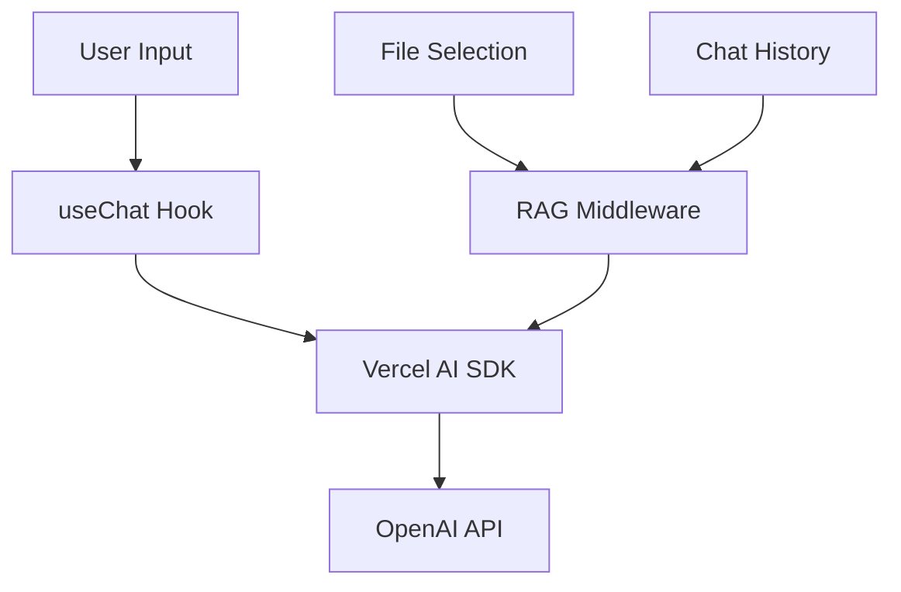
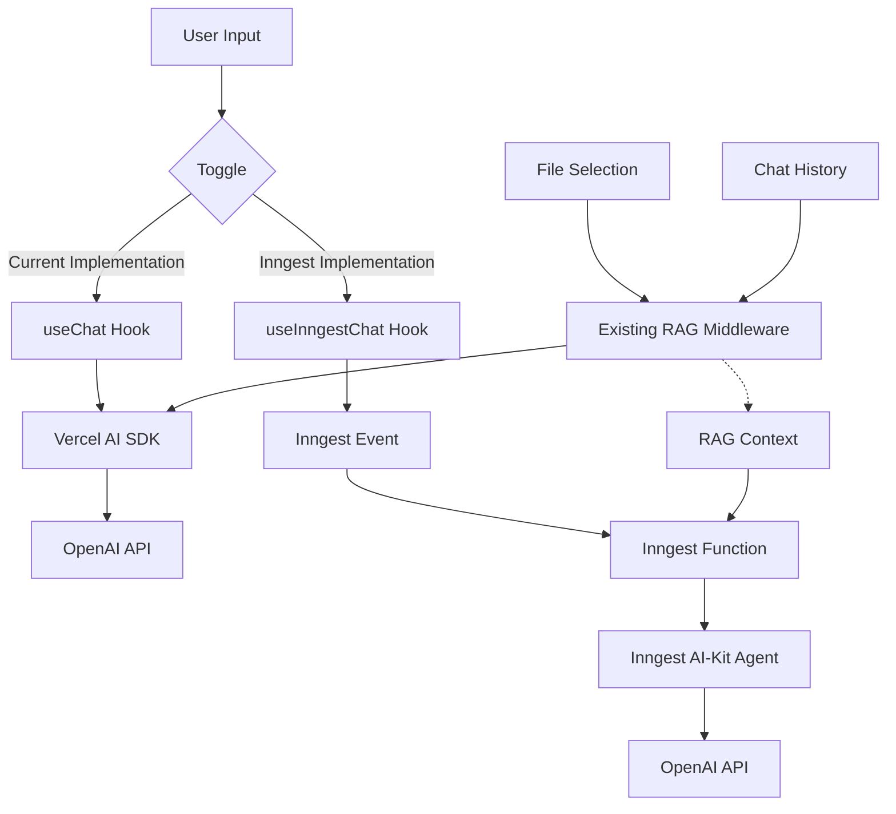

# Inngest AI-Kit POC Implementation Plan

## Current Architecture Overview



## Proposed Architecture with Inngest AI-Kit



## Implementation Plan

### 1. Install Required Dependencies

```bash
npm install @inngest/agent-kit --legacy-peer-deps
```

### 2. Create Inngest AI-Kit Agent

Create a new file `inngest/ai-agent.ts` to define the OpenAI agent using Inngest AI-Kit:

```typescript
import { createAgent, openai } from '@inngest/agent-kit';

export const chatAgent = createAgent({
  name: 'Chat Agent',
  description: 'Handles chat conversations with RAG enhancement',
  system: 'You are a helpful assistant that provides accurate and relevant information.',
  model: openai({
    model: 'gpt-4o',
    max_tokens: 1000,
  }),
});
```

### 3. Create Inngest Function for Chat

Update `inngest/functions.ts` to add a new function for handling chat:

```typescript
export const handleChat = inngest.createFunction(
  { id: "handle-chat" },
  { event: "chat/message" },
  async ({ event, step }) => {
    // Extract data from the event
    const { messages, ragContext, sessionId } = event.data;
    
    // Process with AI-Kit
    const response = await step.run("process-with-ai-kit", async () => {
      // Use the chatAgent to process the message
      const result = await chatAgent.chat({
        messages: messages,
        // Include RAG context in the system message
        system: `You are a helpful assistant. ${ragContext ? 'Here is some relevant information that might help with your response: ' + ragContext : ''}`,
      });
      
      return result;
    });
    
    return {
      response: response.content,
      sessionId: sessionId,
    };
  }
);
```

### 4. Update Inngest API Route

Update `app/api/inngest/route.ts` to include the new function:

```typescript
import { serve } from "inngest/next";
import { inngest } from "../../../inngest/client";
import { helloWorld, processData, handleChat } from "../../../inngest/functions";

export const { GET, POST, PUT } = serve({
  client: inngest,
  functions: [
    helloWorld,
    processData,
    handleChat, // Add the new chat function
  ],
});
```

### 5. Create API Route for Inngest Chat

Create a new file `app/api/chat/inngest/route.ts` to handle chat requests via Inngest:

```typescript
import { inngest } from "../../../../inngest/client";
import { ragMiddleware } from "../../../../ai/rag-middleware";
import { openai } from "@ai-sdk/openai";
import { embedMany } from "ai";

export async function POST(request: Request) {
  const body = await request.json();
  const { messages, selectedFilePathnames, sessionId, chatId } = body;
  
  // Use the existing RAG middleware logic to get context
  // We'll extract just the RAG context without modifying the messages
  const lastUserMessage = messages[messages.length - 1];
  let ragContext = "";
  
  if (lastUserMessage && lastUserMessage.role === "user") {
    // Get the content of the last user message
    const userMessageContent = typeof lastUserMessage.content === 'string' 
      ? lastUserMessage.content 
      : lastUserMessage.content.filter(c => c.type === 'text').map(c => c.text).join("\n");
    
    // Use the existing RAG middleware logic to get relevant chunks
    // This is a simplified version - in a real implementation, you would
    // extract this logic from the ragMiddleware.ts file
    
    // For the POC, we'll just send the event without actual RAG context
    // and implement this later
  }
  
  // Send event to Inngest
  const result = await inngest.send({
    name: "chat/message",
    data: {
      messages,
      ragContext,
      sessionId,
      chatId,
      selectedFilePathnames,
    },
  });
  
  // For the POC, we'll return a simple response
  // In a real implementation, we would set up polling or another mechanism
  // to get the actual response from Inngest
  return Response.json({
    message: "Chat event sent to Inngest",
    eventId: result.ids[0],
  });
}
```

### 6. Create API Route for Polling Inngest Results

Create a new file `app/api/chat/inngest/poll/route.ts` to poll for results:

```typescript
export async function GET(request: Request) {
  const { searchParams } = new URL(request.url);
  const eventId = searchParams.get("eventId");
  
  if (!eventId) {
    return Response.json({ error: "No event ID provided" }, { status: 400 });
  }
  
  // In a real implementation, you would query Inngest for the result
  // For the POC, we'll simulate a delay and return a mock response
  
  // Simulate delay
  await new Promise((resolve) => setTimeout(resolve, 1000));
  
  return Response.json({
    response: "This is a response from Inngest AI-Kit!",
    completed: true,
  });
}
```

### 7. Create Custom Hook for Inngest Chat

Create a new file `hooks/use-inngest-chat.ts`:

```typescript
"use client";

import { useState, useEffect } from "react";
import { Message } from "ai";
import { RagChunk, RagMetadata, MessageWithRag } from "./use-chat-with-rag";

export function useInngestChat(options: {
  body: { id: string; selectedFilePathnames: string[]; sessionId: string };
  initialMessages: Message[];
  onFinish?: () => void;
}) {
  const [messages, setMessages] = useState<Message[]>(options.initialMessages || []);
  const [messagesWithRag, setMessagesWithRag] = useState<MessageWithRag[]>([]);
  const [input, setInput] = useState("");
  const [isLoading, setIsLoading] = useState(false);
  const [eventId, setEventId] = useState<string | null>(null);

  // Poll for results if we have an eventId
  useEffect(() => {
    if (!eventId) return;
    
    const pollInterval = setInterval(async () => {
      try {
        const response = await fetch(`/api/chat/inngest/poll?eventId=${eventId}`);
        const data = await response.json();
        
        if (data.completed) {
          clearInterval(pollInterval);
          setEventId(null);
          
          // Add assistant message to the list
          const assistantMessage: MessageWithRag = {
            role: "assistant",
            content: data.response,
            id: Date.now().toString(),
          };
          
          setMessages((prev) => [...prev, assistantMessage]);
          setMessagesWithRag((prev) => [...prev, assistantMessage]);
          
          // Call onFinish callback if provided
          if (options.onFinish) {
            options.onFinish();
          }
          
          setIsLoading(false);
        }
      } catch (error) {
        console.error("Error polling for results:", error);
      }
    }, 1000);
    
    return () => clearInterval(pollInterval);
  }, [eventId, options.onFinish]);

  // Function to handle form submission
  const handleSubmit = async (e: React.FormEvent<HTMLFormElement>) => {
    e.preventDefault();
    
    if (!input.trim()) return;
    
    // Add user message to the list
    const userMessage: Message = { role: "user", content: input, id: Date.now().toString() };
    setMessages((prev) => [...prev, userMessage]);
    
    // Clear input
    setInput("");
    
    // Set loading state
    setIsLoading(true);
    
    try {
      // Send event to Inngest
      const response = await fetch("/api/chat/inngest", {
        method: "POST",
        headers: {
          "Content-Type": "application/json",
        },
        body: JSON.stringify({
          messages: [...messages, userMessage],
          selectedFilePathnames: options.body.selectedFilePathnames,
          sessionId: options.body.sessionId,
          chatId: options.body.id,
        }),
      });
      
      if (!response.ok) {
        throw new Error("Failed to send message");
      }
      
      const data = await response.json();
      setEventId(data.eventId);
      
      // Note: We don't add the assistant message here
      // It will be added when polling completes
    } catch (error) {
      console.error("Error sending message:", error);
      setIsLoading(false);
      // Handle error (e.g., add error message to chat)
    }
  };

  // Function to append a message programmatically
  const append = async (message: Message) => {
    setMessages((prev) => [...prev, message]);
    
    // If it's a user message, trigger a response
    if (message.role === "user") {
      // Similar logic to handleSubmit but without form event
      setIsLoading(true);
      
      try {
        const response = await fetch("/api/chat/inngest", {
          method: "POST",
          headers: {
            "Content-Type": "application/json",
          },
          body: JSON.stringify({
            messages: [...messages, message],
            selectedFilePathnames: options.body.selectedFilePathnames,
            sessionId: options.body.sessionId,
            chatId: options.body.id,
          }),
        });
        
        if (!response.ok) {
          throw new Error("Failed to send message");
        }
        
        const data = await response.json();
        setEventId(data.eventId);
      } catch (error) {
        console.error("Error sending message:", error);
        setIsLoading(false);
      }
    }
  };

  return {
    messages,
    messagesWithRag,
    input,
    setInput,
    handleSubmit,
    isLoading,
    append,
  };
}
```

### 8. Update Utils Constants

Update `utils/constants.ts` to add a toggle for switching between implementations:

```typescript
export const USE_INNGEST_AI_KIT = "use-inngest-ai-kit";
```

### 9. Update Chat Component to Support Both Implementations

Modify `components/chat.tsx` to support both implementations:

```typescript
"use client";

import { Message } from "ai";
import { useChat, type MessageWithRag } from "@/hooks/use-chat-with-rag";
import { useInngestChat } from "@/hooks/use-inngest-chat";
import { useEffect, useState } from "react";
import { Files } from "@/components/files";
import { AnimatePresence, motion } from "framer-motion";
import { FileIcon, InfoIcon } from "@/components/icons";
import { Message as PreviewMessage } from "@/components/message";
import { useScrollToBottom } from "@/components/use-scroll-to-bottom";
import { generateSessionId, SESSION_ID_KEY, USE_INNGEST_AI_KIT } from "@/utils/constants";
import { RagVisualizer } from "@/components/rag-visualizer";

// ... existing code ...

export function Chat({
  id,
  initialMessages,
}: {
  id: string;
  initialMessages: Array<Message>;
}) {
  // ... existing state ...
  
  // Add state for toggling between implementations
  const [useInngest, setUseInngest] = useState(false);
  
  // Initialize or retrieve the toggle state when the component mounts
  useEffect(() => {
    const storedUseInngest = localStorage.getItem(USE_INNGEST_AI_KIT);
    setUseInngest(storedUseInngest === "true");
  }, []);
  
  // Save toggle state to localStorage
  useEffect(() => {
    if (isMounted) {
      localStorage.setItem(USE_INNGEST_AI_KIT, useInngest.toString());
    }
  }, [useInngest, isMounted]);
  
  // Use the appropriate hook based on the toggle
  const chatHookResult = useInngest
    ? useInngestChat({
        body: { id, selectedFilePathnames, sessionId },
        initialMessages,
        onFinish: () => {
          window.history.replaceState({}, "", `/${id}`);
        },
      })
    : useChat({
        body: { id, selectedFilePathnames, sessionId },
        initialMessages,
        onFinish: () => {
          window.history.replaceState({}, "", `/${id}`);
        },
      });
  
  const { messages, messagesWithRag, handleSubmit, input, setInput, append, isLoading } = chatHookResult;
  
  // ... existing code ...
  
  return (
    <div className="flex flex-row justify-center pb-20 h-dvh bg-white dark:bg-zinc-900">
      <div className="flex flex-col justify-between items-center gap-4">
        {/* Add toggle for switching between implementations */}
        <div className="w-full flex justify-end px-4 py-2">
          <div className="flex items-center">
            <span className="mr-2 text-sm text-zinc-500">Use Inngest AI-Kit</span>
            <label className="relative inline-flex items-center cursor-pointer">
              <input
                type="checkbox"
                className="sr-only peer"
                checked={useInngest}
                onChange={() => setUseInngest(!useInngest)}
              />
              <div className="w-11 h-6 bg-gray-200 peer-focus:outline-none peer-focus:ring-4 peer-focus:ring-blue-300 dark:peer-focus:ring-blue-800 rounded-full peer dark:bg-gray-700 peer-checked:after:translate-x-full peer-checked:after:border-white after:content-[''] after:absolute after:top-[2px] after:left-[2px] after:bg-white after:border-gray-300 after:border after:rounded-full after:h-5 after:w-5 after:transition-all dark:border-gray-600 peer-checked:bg-blue-600"></div>
            </label>
          </div>
        </div>
        
        {/* ... existing code ... */}
        
        {/* Add loading indicator for Inngest implementation */}
        {isLoading && (
          <div className="absolute bottom-20 left-1/2 transform -translate-x-1/2 bg-blue-500 text-white px-4 py-2 rounded-full">
            Processing with Inngest AI-Kit...
          </div>
        )}
      </div>
      
      {/* ... existing code ... */}
    </div>
  );
}
```

### 10. Testing and Debugging

1. Start the Next.js application:
   ```bash
   npm run dev
   ```

2. Start the Inngest dev server:
   ```bash
   npx inngest-cli@latest dev
   ```

3. Open the application and toggle between the current implementation and the Inngest AI-Kit implementation to compare them.

4. Use the Inngest dev dashboard at http://localhost:8288 to monitor events and function executions.

## Key Differences in This Approach

1. **Focus on Chat Logic**: We're focusing solely on the chat logic and leaving the embedding logic as is.

2. **Simplified RAG Integration**: For the POC, we're using a simplified approach to RAG integration, focusing on getting the basic functionality working first.

3. **Non-Streaming Responses**: We're accepting that the Inngest implementation might not stream responses in the POC phase, with a note that this is a limitation.

4. **Simple Polling Mechanism**: We're using a simple polling mechanism for the POC, with the understanding that this can be improved in future iterations.

## Future Enhancements

1. **Streaming Responses**: Investigate if Inngest AI-Kit supports streaming responses or implement a client-side simulation of streaming.

2. **Improved RAG Integration**: Fully integrate the RAG functionality with Inngest AI-Kit.

3. **Better Result Retrieval**: Replace polling with a more elegant solution for retrieving results from Inngest.

4. **Error Handling**: Implement more robust error handling and retries.

5. **Monitoring and Analytics**: Add monitoring and analytics to track the performance and usage of both implementations.